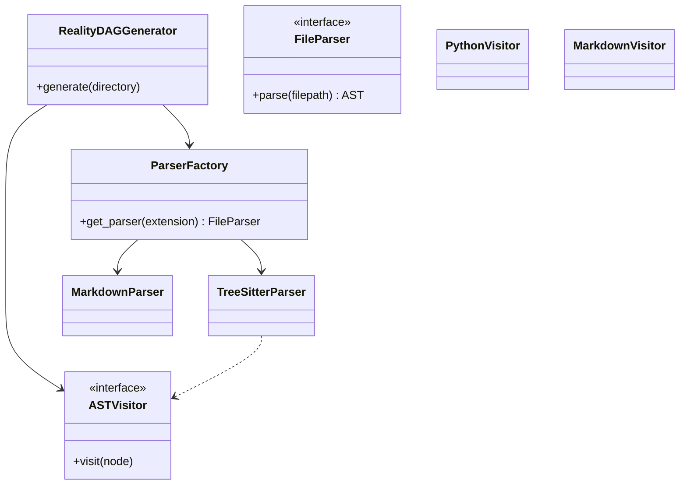

# Research Spike: Multi-Language Tree-Sitter & Visitor Pattern Architecture

## 1. Objective
Research and design a stack-agnostic approach to parse heterogeneous files (.py, .md, .ts, etc.) into a unified Reality DAG using Tree-Sitter and a flexible Visitor Pattern in Python.

## 2. Tree-Sitter Dynamic Loading
Currently, `tree-sitter-python` is hardcoded. To make this stack-agnostic:
- **ParserFactory**: Implement a `ParserFactory` class that registers file extensions to specific `tree-sitter` Language objects.
- **Language Bindings**: Use the `tree_sitter_languages` package (or dynamically compile grammars via `Language.build_library`) to load `.py`, `.js`, `.ts`, `.go`, etc.
- **Resolution**: Given a file path, `ParserFactory.get_parser(filepath)` determines the extension, loads the correct grammar, and returns a configured `tree_sitter.Parser`.

## 3. Markdown and YAML Frontmatter
The system needs to parse Agent configurations defined in Markdown files with YAML frontmatter.
- **Approach**: While `tree-sitter-markdown` exists, extracting frontmatter can be more robustly handled by a specialized `MarkdownParser`. 
- **Implementation**: We can create a unified `FileParser` interface. `TreeSitterParser` handles code files, while `MarkdownFrontmatterParser` handles `.md` files by splitting the YAML block (via regex or python-frontmatter) and passing the YAML to a standard parser to generate `DAGNode`s for Agents, Tools, etc.

## 4. Multi-Language Visitor Pattern
To traverse different ASTs:
- **Abstract `ASTVisitor`**: A base class with a generic `visit(node)` method.
- **Language-Specific Visitors**: Extend `ASTVisitor` (e.g., `PythonASTVisitor`, `TypeScriptASTVisitor`). They implement methods like `visit_class_definition` or `visit_function_declaration`.
- **DAG Construction**: Each visitor is responsible for mapping its language's specific AST nodes into language-agnostic `DAGNode` entities (e.g., Module, Class, Function).
- **Orchestration**: The `RealityDAGGenerator` delegates file parsing to the `ParserFactory`, which returns an AST. It then instantiates the correct `ASTVisitor` to walk the tree and populate the Reality DAG.

## 5. Proposed Architecture Diagram (Mental Model)

## 6. Recommendations
1. Introduce a `ParserFactory` mapped to file extensions.
2. Build a `FileParser` abstraction to handle both Tree-Sitter and purely text-based (Markdown/YAML) parsing.
3. Use language-specific Visitors that translate language ASTs into a unified Reality DAG model.
