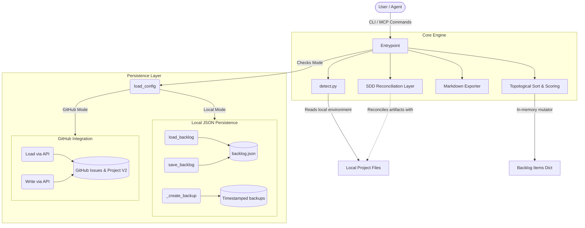

# Agentic Backlog Architecture

This document describes the high-level architecture and data flow of the `agentic-backlog-cli` tool.

## System Overview

> **Note:** Please read [VISION.md](./VISION.md) to understand the foundational North-Star of this project—the Semantic Roadmap Graph—before making architectural changes.

The CLI acts as a deterministic backlog manager using a 3-Dimensional matrix (Impact, Effort, Dependency) to calculate priority scores and topologically sort tasks. State is persisted in a local JSON DAG (`backlog.json`) and can optionally be projected and synced with GitHub Projects/Issues.

## Data Flow

### 1. Command Dispatch

User invokes a command (e.g., `add`, `update`, `prioritize`, `next`, `status`, `block`, `unblock`, `export`, `init`). The `argparse` router dispatches to the appropriate command handler.

### 2. State Loading

The command handler reads the current state from `backlog.json` via `load_backlog()`. If the file does not exist, an empty dictionary is returned.

### 3. State Modification & Backup

For mutating commands, `_create_backup()` is called immediately to create a timestamped backup before any modifications occur. Backups older than 7 days are pruned automatically.

### 4. Prioritization Engine (`_compute_sorted_items`)

When prioritizing or retrieving the next task, the system performs:

1. **Cycle Detection & Topological Sort**: A depth-first search (DFS) algorithm traces the dependency graph (`requires` fields). If a cycle is detected, execution aborts with an error. Otherwise, a valid topological order is generated.
2. **Base Scoring**: Items receive a base score of `Impact + (5 - Effort)`. Completed items are given a base score of 0.
3. **Dependency Boosting**: Iterating in reverse topological order, each item inherits 50% of the scores of its direct dependents.
4. **Tie-Breaking**: Items are inserted into a priority queue factoring in their final score and a category weight (Security > Reliability > Business > other).
5. **Auto-Status**: Any incomplete item with non-empty `blockers` automatically switches to the `Blocked` status.

### 5. State Persistence

Depending on the configured mode (`.agentic-backlog.json`), the final sorted items are either saved to `backlog.json` locally or synchronized directly with GitHub Issues and Projects V2 via the GitHub API.

## Framework Detection and SDD Reconciliation

The `init` command leverages `detect.py` to inspect the working directory for well-known framework identifiers (e.g., `package.json`, `pyproject.toml`, `Cargo.toml`). If a framework is detected, `generate_seed_backlog()` is invoked to pre-populate boilerplate tasks.

Furthermore, when working alongside Spec-Driven Development (SDD) frameworks like Open-Spec or Spec-Kit, the **SDD Reconciliation Layer** aims to reconcile overlapping feature sets. Since GitHub acts as the authoritative source of truth for the backlog, this layer intelligently synchronizes GitHub issues with local SDD markdown artifacts, satisfying each framework's workflow requirements without risking duplicate states or conflicting priorities.
