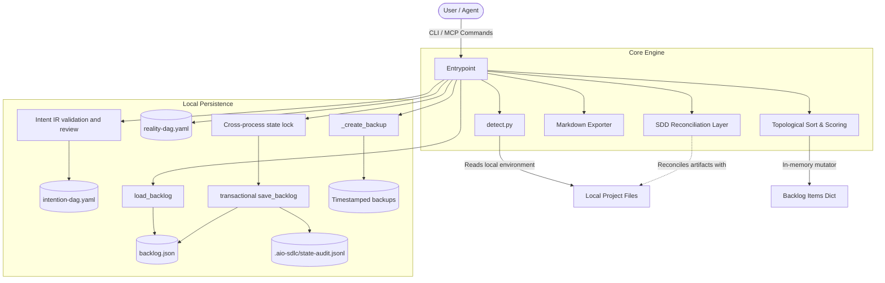

# Agentic Backlog Architecture

This document describes the high-level architecture and data flow of the `aio-agentic-sdlc-cli` tool.

## System Overview

> **Note:** Please read [VISION.md](./VISION.md) to understand the foundational North-Star of this project—the Semantic Roadmap Graph—before making architectural changes.

The CLI acts as a deterministic backlog manager using a 3-Dimensional matrix (Impact, Effort, Dependency) to calculate priority scores and topologically sort tasks. All framework state is local. External trackers are not authoritative and synchronization support is intentionally absent.

## Data Flow

### 1. Command Dispatch

User invokes a command (e.g., `add`, `update`, `prioritize`, `next`, `status`, `block`, `unblock`, `export`, `init`). The `argparse` router dispatches to the appropriate command handler.

### 2. Local State Contract

The local files have distinct responsibilities:

- `intention-dag.yaml` is the durable, version-controlled source of truth for intended behavior and canonical GUIDs.
- `reality-dag.yaml` is a regenerable observation of the repository. It is evidence, not intent.
- `backlog.json` is a local, gitignored execution queue derived from the difference between the two DAGs. CLI and MCP backlog mutations operate only on this file.
- `.aio-sdlc/state-audit.jsonl` is an append-only, gitignored transaction journal used to reconcile interrupted replacements.
- `.agentic-backlog.json` is a retired generated artifact. Runtime code does not read it; `aio-sdlc migrate-state --retire-legacy` preserves a hash-named copy under ignored operational state before removing it.

Framework tools, rather than hand edits, perform state transitions. External issue trackers may be reintroduced later as one-way projections, but they cannot select or replace the authoritative state.

Intention DAG nodes can embed the versioned Intent IR v1 contract. Intent IR records provenance,
assumptions, ambiguities, confidence, acceptance criteria and their required evidence, revision
history, generator ownership, and approval state. Existing nodes remain readable during migration,
but strict validation requires Intent IR on every node. `dag-tool intent-summary` provides a
human-readable review surface without exposing raw graph YAML. The schema decision and migration
tradeoffs are recorded in [ADR 0002](adr/0002-intent-ir-v1.md).

### 3. State Loading

The command handler reads the current state from `backlog.json` via `load_backlog()`. If the file does not exist, a schema-versioned empty envelope is returned. Unversioned `items` or `nodes` documents are migrated deterministically in memory; `aio-sdlc migrate-state` explicitly persists the current schema. A schema newer than the installed framework fails closed.

### 4. State Modification & Backup

For mutating commands, `_create_backup()` is called immediately to create a timestamped backup before any modifications occur. Backups older than 7 days are pruned automatically.

Every backlog contains a monotonic `revision`. A cross-process lock covers the
compare-and-replace transaction, and stale revisions are rejected instead of
overwriting newer work. The writer flushes a temporary file, appends a `prepared`
audit record, atomically replaces the backlog, and appends `committed`. On the next
read, a prepared transaction without a terminal record is classified by its
before/after hashes as either `rolled_back` or `recovered_commit`; any other hash
fails closed.

### 5. Prioritization Engine (`_compute_sorted_items`)

When prioritizing or retrieving the next task, the system performs:

1. **Cycle Detection & Topological Sort**: A depth-first search (DFS) algorithm traces the dependency graph (`requires` fields). If a cycle is detected, execution aborts with an error. Otherwise, a valid topological order is generated.
2. **Base Scoring**: Items receive a base score of `Impact + (5 - Effort)`. Completed items are given a base score of 0.
3. **Dependency Boosting**: Iterating in reverse topological order, each item inherits 50% of the scores of its direct dependents.
4. **Tie-Breaking**: Items are inserted into a priority queue factoring in their final score and a category weight (Security > Reliability > Business > other).
5. **Auto-Status**: Any incomplete item with non-empty `blockers` automatically switches to the `Blocked` status.

### 6. State Persistence

The final sorted items are saved to the local `backlog.json` using schema version 1. The `.aio-agentic-sdlc.json` file configures hierarchy and validation behavior; `core.mode` is always `local`. The transaction implementation and its tradeoffs are recorded in [ADR 0001](adr/0001-versioned-local-state.md).

## Framework Detection and SDD Reconciliation

The `init` command leverages `detect.py` to inspect the working directory for well-known framework identifiers (e.g., `package.json`, `pyproject.toml`, `Cargo.toml`). If a framework is detected, `generate_seed_backlog()` is invoked to pre-populate boilerplate tasks.

Furthermore, when working alongside Spec-Driven Development (SDD) frameworks like Open-Spec or Spec-Kit, the **SDD Reconciliation Layer** aims to reconcile overlapping feature sets. Reconciliation imports useful local artifacts into the local model without promoting either those artifacts or an external tracker above the Intention DAG.
