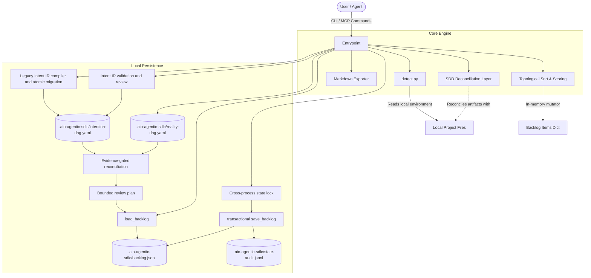

# AIO Agentic SDLC Architecture

This document describes the high-level architecture and data flow of the
`aio-agentic-sdlc` framework.

## System Overview

> **Note:** Please read [VISION.md](./VISION.md) to understand the foundational North-Star of this project—the Semantic Roadmap Graph—before making architectural changes.

The CLI and MCP server act as deterministic backlog interfaces using a 3-Dimensional matrix
(Impact, Effort, Dependency) to calculate priority scores and topologically sort tasks. The MCP
adapter uses the official Python SDK v2 `MCPServer` API over stdio. All framework state is local.
External trackers are not authoritative and synchronization support is intentionally absent.

## Repository layout

The repository root contains only host-platform integration, source, tests, documentation,
and build configuration. Framework-owned project artifacts share one parent.

| Path | Responsibility |
| --- | --- |
| `AGENTS.md` | Repository instructions discovered by Codex from the workspace root. |
| `.agents/` | Agent definitions, legacy rules, workflows, and marketplace metadata. |
| `.codex/` | Repository-scoped Codex agent adapters. |
| `.github/`, `.husky/` | CI and commit-hook integration. |
| `plugins/` | Distributable Codex plugin. |
| `src/`, `tests/`, `doc/` | Product code, verification, and durable documentation. |
| `.aio-agentic-sdlc/` | Canonical DAGs, framework artifacts, and ignored local runtime state. |

`AGENTS.md` must not be moved into `.agents/`: Codex assigns those paths different
meanings, and repository instruction discovery depends on the root filename.


```mermaid
graph TD
    User([User / Agent]) -->|CLI / MCP Commands| CLI[Entrypoint]
    
    subgraph Core Engine
        CLI --> Detect[detect.py]
        CLI --> Sort[Topological Sort & Scoring]
        CLI --> Export[Markdown Exporter]
        CLI --> SDDRecon[SDD Reconciliation Layer]
    end
    
    subgraph Local Persistence
        CLI --> IntentReview[Intent IR validation and review]
        CLI --> IntentMigration[Legacy Intent IR compiler and atomic migration]
        IntentMigration --> Intent
        IntentReview --> Intent[(.aio-agentic-sdlc/intention-dag.yaml)]
        CLI --> Reality[(.aio-agentic-sdlc/reality-dag.yaml)]
        Intent --> Reconcile[Evidence-gated reconciliation]
        Reality --> Reconcile
        Reconcile --> SafePlan[Bounded review plan]
        SafePlan --> ReadJSON
        CLI --> ReadJSON[load_backlog]
        ReadJSON --> FileDB[(.aio-agentic-sdlc/backlog.json)]
        CLI --> Lock[Cross-process state lock]
        Lock --> WriteJSON[transactional save_backlog]
        WriteJSON --> FileDB
        WriteJSON --> Audit[(.aio-agentic-sdlc/state-audit.jsonl)]
    end

    Detect -->|Reads local environment| Workspace[Local Project Files]
    SDDRecon -.->|Reconciles artifacts with| Workspace
    Sort -->|In-memory mutator| Items[Backlog Items Dict]
```

## Data Flow

### 1. Command Dispatch

User invokes a command (e.g., `add`, `update`, `prioritize`, `next`, `status`, `block`, `unblock`, `export`, `init`). The `argparse` router dispatches to the appropriate command handler.

### 2. Local State Contract

The local files have distinct responsibilities:

- `.aio-agentic-sdlc/intention-dag.yaml` is the durable, version-controlled source
  of truth for intended behavior and canonical GUIDs.
- `.aio-agentic-sdlc/reality-dag.yaml` is a regenerable observation of the repository.
  It is evidence, not intent.
- `.aio-agentic-sdlc/backlog.json` is a local, gitignored execution queue derived
  from the difference between the two DAGs. CLI and MCP backlog mutations operate
  only on this file.
- `.aio-agentic-sdlc/state-audit.jsonl` is an append-only, gitignored transaction
  journal used to reconcile interrupted replacements.
- `.aio-agentic-sdlc/config.json` stores project-local hierarchy and validation
  configuration.
- `.aio-agentic-sdlc/{inbox,changes,specs,archive,research-spikes}/` contains the
  framework's project artifacts instead of scattering them through the repository root.
- `.agentic-backlog.json` is a retired generated artifact. Runtime code does not read it; `aio-sdlc migrate-state --retire-legacy` preserves a hash-named copy under ignored operational state before removing it.

Projects upgrading from the former scattered layout must run `aio-sdlc migrate-state`.
The migration acquires dedicated workspace, state, and mapping locks, validates all recognized legacy inputs before
moving any of them, and records source/target hashes in `state-audit.jsonl`. It recognizes the old
root backlog, config, Intention and Reality DAG filenames plus `.aio-sdlc` audit/legacy state. The
retired GitHub configuration is stripped while local hierarchy and validation settings are
preserved. A symlink, invalid envelope, or old/new path conflict fails closed; regular state
commands refuse to hide legacy data and direct the operator to migrate first. Generic host-owned
directories such as `specs/` and `changes/` are deliberately outside automatic migration. The
migrator bridges the old and new state and mapping locks, removes known obsolete locks only after release,
deletes the deprecated directory when empty, and reports unknown entries without removing them.

Framework tools, rather than hand edits, perform state transitions. External issue trackers may be reintroduced later as one-way projections, but they cannot select or replace the authoritative state.

Intention DAG nodes can embed the versioned Intent IR v1 contract. Intent IR records provenance,
assumptions, ambiguities, confidence, acceptance criteria and their required evidence, revision
history, generator ownership, and approval state. Existing nodes remain readable during migration,
but strict validation requires Intent IR on every node. `dag-tool intent inventory` reports complete
legacy coverage with bounded detail. `plan-migration` deterministically compiles exact preserved
descriptions, described relationships, and exact-title documents into a digest-bound plan. It
records uncertainty explicitly and cannot approve migrated intent. `apply-migration` acquires the
canonical DAG lock, recompiles the expected plan, rejects stale, incomplete, or altered plans,
validates every payload before mutation, and atomically applies the complete transition. `dag-tool
intent-summary` provides a human-readable review surface without exposing raw graph YAML. The
schema decision and migration tradeoffs are recorded in [ADR 0002](adr/0002-intent-ir-v1.md).

Migration provenance hashes the validated DAG content model with canonical JSON, not raw YAML
bytes. Equivalent line endings therefore retain one source identity across platforms. Inventory
and planning hold the same per-DAG lock as apply, Intent mutation, structural node/edge commands,
and legacy ID migration, so each artifact and write derives from one coherent snapshot. If the DAG
commit succeeds but optional result-report persistence fails, the CLI reports the committed result
inline instead of claiming the migration failed.

The shared guard rejects symlink or reparse-point parents and leaves before load or write, then
revalidates the exact non-following path under lock. Derived JSON report outputs use the same guard.
Legacy ID migration preflights both DAGs for duplicate raw/result identities before replacing
either and restores the first file if the second replacement fails.

Intent IR creation and revision are serialized by a lock beside the canonical DAG under
`.aio-agentic-sdlc/`. Callers provide the
current node revision; stale writers fail instead of overwriting newer interpretation. Revisions
must preserve the complete existing history and append exactly one next entry. DAG replacement is
atomic, so a failed final replace leaves the prior canonical file intact.

Reality generation excludes framework state, VCS data, dependency directories, caches, and common
build outputs such as `build/`, `dist/`, and `*.egg-info`. These deterministic boundaries prevent a
normal package build from duplicating source observations and changing the canonical Reality DAG.

### Evidence-gated reconciliation

Raw GUID inequality is not proof that implementation is missing or unwanted. Before backlog
planning, `ReconciliationEngine` classifies each Intention node as:

- `confirmed`: the Reality DAG contains the same canonical GUID value after canonicalization;
- `candidate`: exactly one Reality node has the same normalized name and node type;
- `ambiguous`: more than one node satisfies that deterministic structural signal; or
- `unmapped`: no deterministic structural candidate exists.

Candidates always require approval. The engine does not use semantic similarity to approve
mappings and does not mutate either DAG. Reality nodes without a confirmed GUID are reported as
`unclassified_reality`; they are not deletion evidence.

Unique Python class and function candidates can pass through a separate approval-gated mapping
transition. Automatic normalized name/type matching remains the default, while an explicit current
observed Reality GUID can select one differently named class or function. The engine independently
resolves that GUID from a fresh Reality scan; caller-supplied source paths, symbols, and line numbers
are never trusted.

Candidate review is read-only and binds fresh reconciliation evidence to one exact source symbol
and SHA-256. Approval requires the reviewed candidate GUID, evidence digest, selection mode,
approver, timezone-aware timestamp, and rationale; it then atomically adds an adjacent canonical
marker plus audit receipt. Every exact digest requires a separate human approval. Stale, ambiguous,
unsupported, duplicate-marker, or escaping-path evidence fails without mutation, and a failed
post-write Reality confirmation restores the original source bytes.

An already confirmed marker can enter a separate receipt-maintenance flow. Read-only receipt review
requires one uniquely confirmed class/function marker and one adjacent parseable receipt, then
binds the current marker, receipt, source bytes, Intent, and fresh Reality observation into a new
digest. Explicit refresh approval preserves the marker byte-for-byte and atomically replaces only
the adjacent receipt. Candidate and receipt decisions establish source identity only; they do not
prove behavior, satisfy acceptance criteria, or approve Intent.

Receipt evidence currently uses the whole annotation-neutral file hash. An unrelated edit in the
same file therefore intentionally stales the receipt and requires another review and separate human
approval. Marker and receipt mutations have no manual fallback: Python, CLI, and MCP adapters all
route through the same persistent locks, stale-evidence checks, guarded atomic transition, rollback,
and post-write Reality verification.

Safe diffing is the default. It produces bounded mapping-review or implementation-investigation
work and includes complete totals plus truncation metadata for both top-level work and nested
candidate identities. Candidate matching uses a deterministic normalized-name/type index, and
Unicode alphanumerics are preserved. It only reports drift for confirmed
identities when Reality contains an observed value that contradicts intent. Missing observations
are not contradictions. The former structural create/remove/disconnect algorithm remains available
only through the explicit `legacy-structural` compatibility mode.

Report writers reject canonical DAG, backlog, transaction-journal, and lock paths. Safe edge work
canonicalizes endpoint GUIDs, deduplicates logical edges, and sorts them before applying limits.

`DriftTriageEngine` is the read-only gate between that safe plan and execution. It uses canonical,
line-ending-independent hashes of both validated DAGs to bind explicit decisions to one exact plan
identity. Non-approved intent and relationships with non-approved endpoints are withheld from
implementation. Relationship shapes outside the Reality parser's observation contract are routed
as framework-tooling drift. Approved gaps that remain uncertain require an explicit, timestamped
decision with concrete evidence; only `missing_implementation` on approved intent is actionable.
The report retains complete totals while bounding returned items and nested acceptance evidence.

```powershell
uv run dag-tool reconcile --intention .aio-agentic-sdlc/intention-dag.yaml `
  --reality .aio-agentic-sdlc/reality-dag.yaml `
  --max-items 100 --max-candidates 20
uv run dag-tool diff --intention .aio-agentic-sdlc/intention-dag.yaml `
  --reality .aio-agentic-sdlc/reality-dag.yaml `
  --max-tasks 100 --max-candidates 20
uv run dag-tool triage --intention .aio-agentic-sdlc/intention-dag.yaml `
  --reality .aio-agentic-sdlc/reality-dag.yaml `
  --max-items 100
uv run dag-tool diff --intention .aio-agentic-sdlc/intention-dag.yaml `
  --reality .aio-agentic-sdlc/reality-dag.yaml `
  --mode legacy-structural
```

### 3. State Loading

The command handler reads `.aio-agentic-sdlc/backlog.json` via `load_backlog()`.
If the file does not exist, a schema-versioned empty envelope is returned. Unversioned
`items` or `nodes` documents are migrated deterministically in memory;
`aio-sdlc migrate-state` explicitly persists the current schema. A schema newer than
the installed framework fails closed.

### 4. Transactional State Modification

Every backlog contains a monotonic `revision`. A cross-process lock covers recovery, load,
mutation, revision increment, audit preparation, atomic replacement, and audit commit as one
transaction. Stale revisions are rejected instead of overwriting newer work. The writer flushes a
temporary file, appends a `prepared` audit record, atomically replaces the backlog, and appends
`committed`. On the next read, a prepared transaction without a terminal record is classified by
its before/after hashes as either `rolled_back` or `recovered_commit`; any other hash fails closed.

This full transaction boundary also applies when MCP SDK v2 dispatches synchronous handlers in
concurrent AnyIO worker threads. Other stateful MCP operations retain their dedicated workspace,
DAG, mapping, semantic-cache, document-output, and spec-promotion locks and guarded atomic
transitions. Handlers resolve explicit project paths without changing the process working
directory. The two fixed resources are the exception to explicit project addressing: they retain
their public cwd-based meaning and read state relative to the MCP server's launch directory.

### 5. Prioritization Engine (`_compute_sorted_items`)

When prioritizing or retrieving the next task, the system performs:

1. **Cycle Detection & Topological Sort**: A depth-first search (DFS) algorithm traces the dependency graph (`requires` fields). If a cycle is detected, execution aborts with an error. Otherwise, a valid topological order is generated.
2. **Base Scoring**: Items receive a base score of `Impact + (5 - Effort)`. Completed items are given a base score of 0.
3. **Dependency Boosting**: Iterating in reverse topological order, each item inherits 50% of the scores of its direct dependents.
4. **Tie-Breaking**: Items are inserted into a priority queue factoring in their final score and a category weight (Security > Reliability > Business > other).
5. **Auto-Status**: Any incomplete item with non-empty `blockers` automatically switches to the `Blocked` status.

### 6. State Persistence

The final sorted items are saved to `.aio-agentic-sdlc/backlog.json` using schema
version 1. `.aio-agentic-sdlc/config.json` configures hierarchy and validation
behavior; `core.mode` is always `local`. The transaction implementation and its
tradeoffs are recorded in [ADR 0001](adr/0001-versioned-local-state.md).

## Framework Detection and SDD Reconciliation

The `init` command leverages `detect.py` to inspect the working directory for well-known framework identifiers (e.g., `package.json`, `pyproject.toml`, `Cargo.toml`). If a framework is detected, `generate_seed_backlog()` is invoked to pre-populate boilerplate tasks.

Furthermore, when working alongside Spec-Driven Development (SDD) frameworks like Open-Spec or Spec-Kit, the **SDD Reconciliation Layer** aims to reconcile overlapping feature sets. Reconciliation imports useful local artifacts into the local model without promoting either those artifacts or an external tracker above the Intention DAG.
