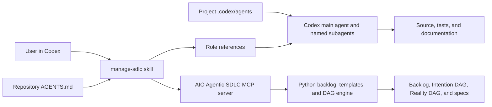

# Codex plugin

The repository includes a Codex plugin under `plugins/aio-agentic-sdlc/` and a repo-scoped
marketplace at `.agents/plugins/marketplace.json`.

## Architecture



The plugin separates concerns as follows:

| Existing Antigravity surface | Codex surface | Migration behavior |
| --- | --- | --- |
| `.agents/agents/*/agent.md` | `.codex/agents/*.toml` | Direct project-scoped named-agent mapping |
| Agent prompt bodies | Skill role references | Portable fallback loaded only when a workflow needs that role |
| `.agents/workflows/sdlc-pipeline.md` | `manage-sdlc` pipeline reference | Routes intake, architecture, implementation, QA, and delivery |
| `.agents/rules/*.md` | Root `AGENTS.md` and skill safeguards | Applies durable repository invariants and task-specific constraints |
| `ask_question` | Codex question UI or direct questions | Uses the available host interaction mechanism |
| `invoke_subagent` | Codex multi-agent support | Used only when available, allowed, and useful for bounded work |
| Antigravity tool names | MCP operation names | Matched by operation rather than provider-specific prefixes |
| Python CLI | UV commands | Remains a fallback and local development interface |

## Install for local testing

Prerequisites are Git, UV, network access to GitHub, and a Codex surface that supports plugins.

1. Open the repository as the active Codex project.
2. Restart the desktop app so it discovers `.agents/plugins/marketplace.json` and the custom
   agents under `.codex/agents/`.
3. Open **Plugins**, select the **Personal** marketplace, and install **AIO Agentic SDLC**.
4. Start a new task so Codex loads the plugin skill and MCP tools.

To track this repo marketplace explicitly from the CLI, run:

```powershell
codex plugin marketplace add .
codex plugin add aio-agentic-sdlc@personal
```

The plugin starts the MCP server with:

```powershell
uvx --from git+https://github.com/aegolius-labs/aio-agentic-sdlc aio-agentic-sdlc-mcp
```

The first start downloads the Python dependency set and can take longer than subsequent starts.
The plugin grants a 120-second MCP startup window for this reason.

## Use

The skill can trigger implicitly, or it can be selected explicitly as `manage-sdlc`. Representative
prompts include:

- “Turn this feature idea into a traceable PRD.”
- “Run this change through the agentic SDLC pipeline.”
- “Show me the highest-priority unblocked task.”
- “Generate the Reality DAG and report traceability drift.”

For MCP calls, pass the absolute target repository as `project_path`. This is especially important
when the plugin is installed because Codex runs the server from a cached plugin package, not from
the target repository.

## Validate changes

From the repository root:

```powershell
uv sync --frozen --group dev
uv run --no-sync pytest tests/test_codex_plugin.py tests/test_mcp_server.py tests/test_mcp_adversarial.py
python C:\Users\Felix\.codex\skills\.system\skill-creator\scripts\quick_validate.py plugins\aio-agentic-sdlc\skills\manage-sdlc
python C:\Users\Felix\.codex\skills\.system\plugin-creator\scripts\validate_plugin.py plugins\aio-agentic-sdlc
```

The validator paths above refer to the built-in authoring skills on Windows. On another machine,
invoke the equivalent bundled `skill-creator` and `plugin-creator` scripts from that Codex install.

## Current boundaries

- Codex custom agents are project configuration, not a documented plugin component. This repo maps
  all ten legacy roles to `.codex/agents/*.toml`; when the plugin is installed in another repo, its
  skill can still delegate the bundled role playbooks to generic subagents.
- Multi-agent execution depends on the Codex surface, policy, and task. The workflow remains usable
  by one agent when delegation is unavailable.
- Local plugins are copied into a Codex cache. Restart or reinstall the plugin and start a new task
  after changing its bundled files.
- The development MCP launcher follows the repository's default Git branch. Pin it to a release tag
  when publishing a stable plugin version.
- The current dependency graph includes a large semantic-search stack, so first-time MCP setup is
  heavier than the backlog operations alone require. Splitting semantic deduplication into an
  optional extra is a useful follow-up optimization.
