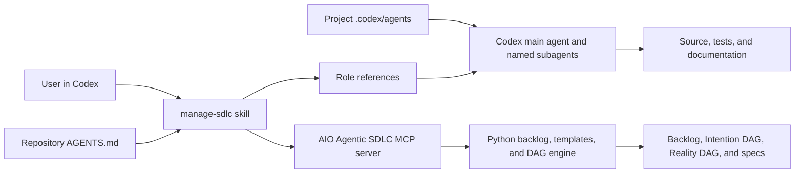

# Codex plugin

The repository includes a Codex plugin under `plugins/aio-agentic-sdlc/` and a repo-scoped
marketplace at `.agents/plugins/marketplace.json`.

## Architecture


```mermaid
flowchart LR
    User["User in Codex"] --> Skill["manage-sdlc skill"]
    Guidance["Repository AGENTS.md"] --> Skill
    Skill --> Roles["Role references"]
    Custom["Project .codex/agents"] --> Codex["Codex main agent and named subagents"]
    Skill --> MCP["AIO Agentic SDLC MCP server"]
    Roles --> Codex
    MCP --> Engine["Python backlog, templates, and DAG engine"]
    Codex --> Repo["Source, tests, and documentation"]
    Engine --> State["Backlog, Intention DAG, Reality DAG, and specs"]
```

The plugin separates concerns as follows:

| Existing Antigravity surface | Codex surface | Migration behavior |
| --- | --- | --- |
| `.agents/agents/*/agent.md` | `.codex/agents/*.toml` | Direct project-scoped named-agent mapping |
| Agent prompt bodies | Skill role references | Portable fallback loaded only when a workflow needs that role |
| `.agents/workflows/sdlc-pipeline.md` | `manage-sdlc` pipeline reference | Routes intake, architecture, implementation, QA, and delivery |
| `.agents/rules/*.md` | Root `AGENTS.md` and skill safeguards | Applies durable repository invariants and task-specific constraints |
| `ask_question` | Codex question UI or direct questions | Uses the available host interaction mechanism |
| `invoke_subagent` | Codex multi-agent support | Used only when available, allowed, and useful for bounded work |
| Antigravity tool names | MCP operation names | Matched by operation rather than provider-specific prefixes |
| Python CLI | UV commands | Remains a fallback and local development interface |

## Install for local testing

Prerequisites are Git, UV, network access to GitHub, and a Codex surface that supports plugins.

1. Open the repository as the active Codex project.
2. Restart the desktop app so it discovers `.agents/plugins/marketplace.json` and the custom
   agents under `.codex/agents/`.
3. Open **Plugins**, select the **Personal** marketplace, and install **AIO Agentic SDLC**.
4. Start a new task so Codex loads the plugin skill and MCP tools.

To track this repo marketplace explicitly from the CLI, run:

```powershell
codex plugin marketplace add .
codex plugin add aio-agentic-sdlc@personal
```

The plugin starts the MCP server with:

```powershell
uvx --from git+https://github.com/aegolius-labs/aio-agentic-sdlc aio-agentic-sdlc-mcp
```

The first start downloads the Python dependency set and can take longer than subsequent starts.
The plugin grants a 120-second MCP startup window for this reason.

## MCP SDK v2 runtime contract

The server uses the official Python SDK v2 `MCPServer` API. The package requirement is
`mcp>=2.0.0,<3`, and this repository's reviewed UV lock resolves MCP 2.0.0. The UVX command above
and the `aio-agentic-sdlc-mcp` stdio entry point are unchanged by the migration.

The verified public surface is:

| Kind | Preserved contract |
| --- | --- |
| Tools | 23 operations: the preserved 21-operation surface plus two additive receipt tools |
| Resources | `backlog://current` and `backlog://hierarchy-rules` |
| Prompt | `pick-next-task` |
| Transport | Installed `aio-agentic-sdlc-mcp` process over stdio |
| Client compatibility | Official SDK v2 `Client` in `auto` and `legacy` modes |

The acceptance suite exercised the installed stdio entry point and genuine calls through both
official client modes. It did not exercise an external Codex host, so a local plugin install is
still the appropriate host-integration smoke test.

SDK v2 executes synchronous handlers concurrently in AnyIO worker threads. Backlog, audit, Intent,
mapping, semantic-cache, document, spec-promotion, and Reality-output transitions therefore retain
their local locks, stale-write checks, guarded paths, and atomic replacements for the complete
operation. Concurrent acceptance tests also verify that handlers do not change the process working
directory.

Expected domain, validation, and guarded-path failures are returned as bounded MCP error results.
Unexpected handler failures are sanitized by the server rather than exposing internal exception
details. Schema validation, unsafe paths, unknown resource URIs, protected-state aliases, and failed
artifact transitions are tested to leave protected state unchanged.

## Use

The skill can trigger implicitly, or it can be selected explicitly as `manage-sdlc`. Representative
prompts include:

- “Turn this feature idea into a traceable PRD.”
- “Run this change through the agentic SDLC pipeline.”
- “Show me the highest-priority unblocked task.”
- “Generate the Reality DAG and report traceability drift.”
- “Reconcile the Intention and Reality DAGs without proposing destructive cleanup.”
- “Triage reconciliation drift and show only approved, evidence-backed implementation work.”
- “Show me a human-readable mapping decision brief for this candidate.”

For MCP tools that accept it, pass the absolute target repository as `project_path`. This is
especially important when the plugin is installed because Codex runs the server from a cached
plugin package, not from the target repository.

The two fixed resource URIs do not accept `project_path`. They read backlog and hierarchy state
relative to the MCP process working directory. Use them only when the server was launched with the
target repository as its working directory; otherwise, use the equivalent project-aware tools such
as `get_next_task`.

For structural candidates, the plugin separates read-only review from mutation. It must show the
human decision brief: intended responsibility and criteria, actual symbol documentation and public
API, related tests, and unresolved gaps. GUIDs and the digest are audit inputs shown last, not a
substitute for review. The default decision is defer because a structural name/type match does not
prove responsibility or behavior.

`review_mapping` keeps automatic name matching when `candidate_reality_id` is omitted. When the
names differ, Cartographer may pass one exact current observed Reality GUID as
`candidate_reality_id`; the matching `approve_mapping` call must replay the reviewed GUID, digest,
and `selection_mode="explicit_observed_guid"`. Only observed Python classes and functions are
supported. Every exact review digest requires a separate human identity-linkage approval, and any
intervening Intent, Reality, source, or displayed evidence change invalidates it.

For a confirmed marker whose receipt is stale, `review_mapping_receipt` produces fresh read-only
maintenance evidence. Only after a human separately approves that exact digest may
`refresh_mapping_receipt` preserve the marker and atomically replace its adjacent receipt. The
current evidence model hashes the whole annotation-neutral file, so an unrelated same-file edit
intentionally makes the receipt stale. Candidate and receipt approval establish source identity
only; they do not establish behavioral correctness, satisfy acceptance criteria, or approve Intent.
Use the MCP operations, CLI, or Python API—there is no manual marker or receipt fallback.

Before implementation, the plugin runs approval-aware drift triage. The human view explains names,
classifications, and routing reasons before its audit identifiers. Non-approved intent never becomes
implementation work, unsupported Reality relationships are tooling drift, and uncertain approved
gaps require a decision set bound to the current Intention and Reality digest.

## Validate changes

From the repository root:

```powershell
uv sync --frozen --group dev
uv run --no-sync python -c "from importlib.metadata import version; print(version('mcp'))"
uv run --no-sync pytest -W error tests/test_mcp_v2_contract.py tests/test_mcp_v2_concurrency.py
uv run --no-sync pytest -W error tests/test_source_identity_maintenance.py
uv run --no-sync pytest -W error tests/test_codex_plugin.py tests/test_mcp_server.py tests/test_mcp_adversarial.py
uv build
python C:\Users\Felix\.codex\skills\.system\skill-creator\scripts\quick_validate.py plugins\aio-agentic-sdlc\skills\manage-sdlc
python C:\Users\Felix\.codex\skills\.system\plugin-creator\scripts\validate_plugin.py plugins\aio-agentic-sdlc
```

The validator paths above refer to the built-in authoring skills on Windows. On another machine,
invoke the equivalent bundled `skill-creator` and `plugin-creator` scripts from that Codex install.

If UV reports that a configured shared cache is inaccessible, select the repository's ignored
cache before synchronizing:

```powershell
$env:UV_CACHE_DIR = Join-Path (Get-Location) ".uv-cache"
uv sync --frozen --group dev
```

## Current boundaries

- Codex custom agents are project configuration, not a documented plugin component. This repo maps
  all ten legacy roles to `.codex/agents/*.toml`; when the plugin is installed in another repo, its
  skill can still delegate the bundled role playbooks to generic subagents.
- Multi-agent execution depends on the Codex surface, policy, and task. The workflow remains usable
  by one agent when delegation is unavailable.
- Local plugins are copied into a Codex cache. Restart or reinstall the plugin and start a new task
  after changing its bundled files.
- The development MCP launcher follows the repository's default Git branch. Pin it to a release tag
  when publishing a stable plugin version.
- The current dependency graph includes a large semantic-search stack, so first-time MCP setup is
  heavier than the backlog operations alone require. Splitting semantic deduplication into an
  optional extra is a useful follow-up optimization.
